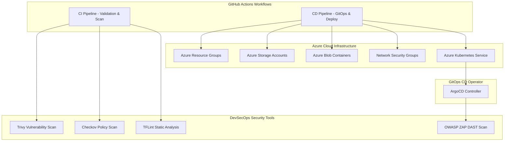

# 🚀 Azure Enterprise Landing Zone & DevSecOps Infrastructure

[](https://github.com/revision/revision/actions/workflows/ci.yaml)
[](https://github.com/revision/revision/actions/workflows/cd.yaml)
[](https://www.terraform.io/)
[](https://azure.microsoft.com/)
[](https://www.docker.com/)
[](https://argoproj.github.io/cd/)
[](#-security--compliance-devsecops)

Enterprise-grade **Infrastructure as Code (IaC)** and **DevSecOps Automation Pipeline** for provisioning, securing, and deploying multi-environment Azure Cloud Infrastructure and Kubernetes applications.

---

## 📋 Table of Contents

- [✨ Key Features](#-key-features)
- [🏗️ Architecture Overview](#️-architecture-overview)
- [📂 Repository Structure](#-repository-structure)
- [🔄 CI/CD & DevSecOps Pipeline](#-cicd--devsecops-pipeline)
  - [Continuous Integration (CI)](#continuous-integration-ci)
  - [Continuous Deployment (CD & GitOps)](#continuous-deployment-cd--gitops)
- [🛡️ Security & Compliance (DevSecOps)](#-security--compliance-devsecops)
- [🛠️ Getting Started](#️-getting-started)
  - [Prerequisites](#prerequisites)
  - [Local Infrastructure Deployment](#local-infrastructure-deployment)
  - [Docker Container Build](#docker-container-build)
- [⚙️ Configuration & Variables](#️-configuration--variables)

---

## ✨ Key Features

- **🧩 Modular IaC Architecture**: Reusable child modules (`resource group`, `storage account`, `container`, `nsg`, `virtual network`, `subnet`) paired with environment-specific parent modules (`preprod`, `prod`).
- **🛡️ Shift-Left DevSecOps**: Automatic static analysis (Checkov, TFLint), container vulnerability scanning (Aquasecurity Trivy), and live DAST dynamic security testing (OWASP ZAP).
- **🐙 GitOps Continuous Deployment**: Automated deployment via ArgoCD on Azure Kubernetes Service (AKS).
- **🐳 Enterprise Containerization**: Optimized Nginx-based container build for high performance application delivery.
- **⚡ Automated Pipeline Verification**: GitHub Actions workflows for automated linting, validation, planning, and deployment.

---

## 🏗️ Architecture Overview



---

## 📂 Repository Structure

```gcode
Infrastructure/
├── .github/
│   └── workflows/
│       ├── ci.yaml             # Continuous Integration & Validation Workflow
│       └── cd.yaml             # Continuous Deployment & GitOps Workflow
├── dockerfile                  # Nginx-based Container Definition
├── terraform/
│   ├── child module/           # Reusable Infrastructure Modules
│   │   ├── container/          # Azure Storage Container module
│   │   ├── nsg/                # Network Security Group module
│   │   ├── resource group/     # Azure Resource Group module
│   │   ├── storage account/    # Azure Storage Account module
│   │   ├── subnet/             # Subnet module
│   │   └── virtual network/    # Virtual Network module
│   └── parent module/          # Root Deployment Configurations
│       └── Environments/
│           ├── preprod/        # Pre-production environment
│           └── prod/           # Production environment (main.tf, terraform.tfvars, etc.)
└── README.md                   # Project Documentation
```

---

## 🔄 CI/CD & DevSecOps Pipeline

### Continuous Integration (`ci.yaml`)

Triggered on code pushes to `main`. Consists of 3 sequential validation jobs:

1. **Source Code Validation**: Set up Java 17 environment and SonarQube quality gate analysis.
2. **Container Validation**: Build Docker image (`landingzone:latest`) and perform Aquasecurity Trivy vulnerability scanning for `HIGH` and `CRITICAL` severity issues.
3. **Infrastructure Validation**:
   - `terraform init` & `terraform validate`
   - **TFLint** linting & syntax verification
   - **Checkov** static security and compliance analysis
   - `terraform plan` execution & artifact packaging

### Continuous Deployment (`cd.yaml`)

Triggered on pull requests to `main`. Executed in 3 deployment stages:

1. **Infrastructure Provisioning**: Automated login to Azure via OpenID Connect (OIDC), initializing and applying Terraform configurations to Azure `prod` environment.
2. **ArgoCD GitOps Deployment**: Provision ArgoCD on Azure Kubernetes Service (AKS), sync application manifests, and resolve external LoadBalancer endpoints.
3. **OWASP ZAP Security Testing**: Execute automated DAST baseline vulnerability scan on the live endpoint and generate detailed HTML security reports.

---

## 🛡️ Security & Compliance (DevSecOps)

Security is integrated directly into the deployment lifecycle:

| Layer | Tool | Purpose |
| :--- | :--- | :--- |
| **IaC Static Security** | Checkov | Scans Terraform code for security misconfigurations and CIS benchmarks. |
| **IaC Code Quality** | TFLint | Enforces Terraform best practices and flags provider-specific errors. |
| **Container Scanning** | Aquasecurity Trivy | Scans container images for OS package CVEs and exposed vulnerabilities. |
| **Dynamic Security (DAST)** | OWASP ZAP | Performs automated web application vulnerability scanning on live endpoints. |

---

## 🛠️ Getting Started

### Prerequisites

Ensure you have the following CLI tools installed:

- [Terraform](https://www.terraform.io/downloads) `^1.13.0`
- [Azure CLI](https://docs.microsoft.com/en-us/cli/azure/install-azure-cli) `^2.50.0`
- [Docker](https://www.docker.com/products/docker-desktop)
- [TFLint](https://github.com/terraform-linters/tflint)
- [Checkov](https://www.checkov.io/)

### Local Infrastructure Deployment

1. **Navigate to the target environment**:
   ```bash
   cd "terraform/parent module/Environments/prod"
   ```

2. **Initialize Terraform**:
   ```bash
   terraform init
   ```

3. **Validate configuration**:
   ```bash
   terraform validate
   ```

4. **Generate execution plan**:
   ```bash
   terraform plan -out=tfplan
   ```

5. **Apply configuration**:
   ```bash
   terraform apply tfplan
   ```

### Docker Container Build

```bash
# Build the application image
docker build -t landingzone:latest .

# Run container locally on port 8080
docker run -d -p 8080:80 landingzone:latest
```

---

## ⚙️ Configuration & Variables

Infrastructure parameters are defined in `terraform/parent module/Environments/prod/terraform.tfvars`:

```hcl
resource = {
  rgss = {
    name     = "rg_rg1"
    location = "centralindia"
  }
}

store = {
  str1 = {
    name     = "storage89734512897"
    resource = "rg_rg1"
    location = "centralindia"
    type     = "ZRS"
    tier     = "Standard"
  }
}
```

---

<p align="center">
  <i>Built with ❤️ using Terraform, Azure, Docker, ArgoCD, and GitHub Actions.</i>
</p>
